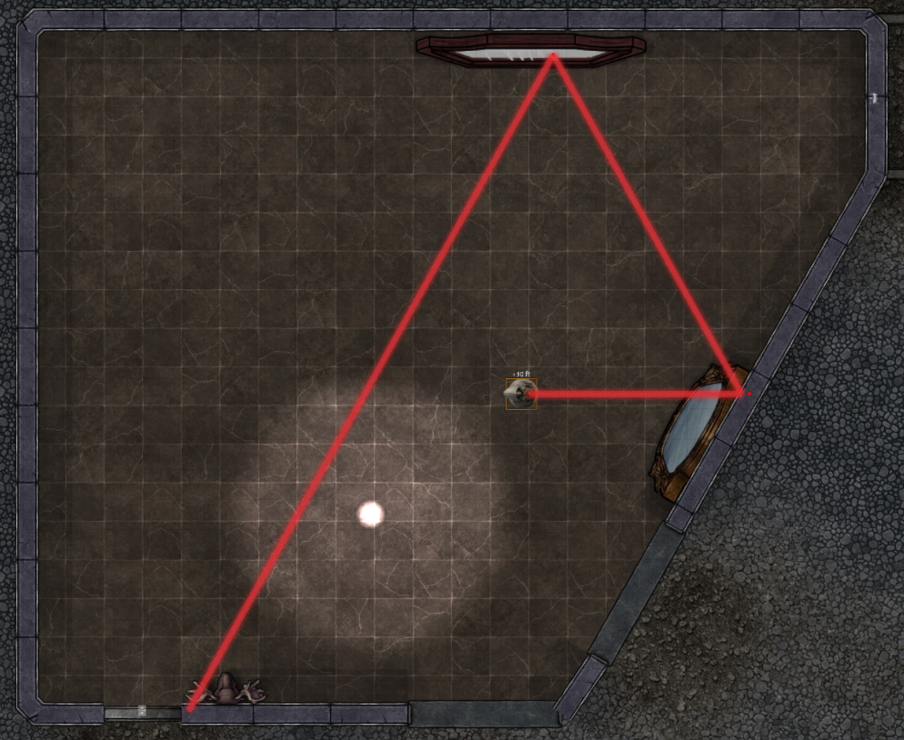
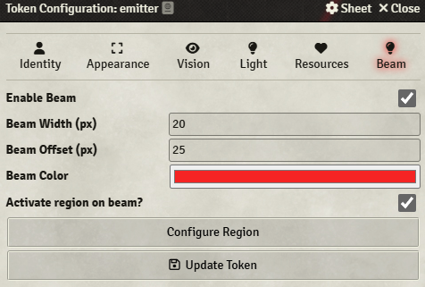
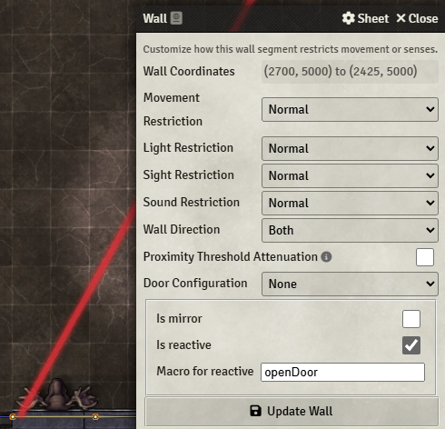

# foundry-beams
- 
- 
- 

A Foundry VTT module that lets tokens emit animated, glowing beam segments — with support for reflections, shader effects, regions, and module API integration.



As shown in the image a beam is emitted from the statue it bounces on 2 walls and than hit a elk head trophy mount that triggers the opening of a secret door.


## ✨ Features

- 🔦 Create directional, light beams from tokens
- 🔁 Reflect off flagged mirror walls and pass through windows or open doors; wall/mirror can move and beam react accordingly
- 📐 Generates Foundry v12 Region polygons matching the beam's path
- 🔌 Provides API methods for other modules to control beam behavior

## 📦 Installation

Install it as a Foundry VTT module from within the module section.

> Requires **Foundry VTT v12+**

## 🚀 Usage

### Enable Beam on a Token

1. Open token configuration.

2. Use the new **"Beam" tab** to configure:
   - Beam enabled
   - Color (hex)
   - Width
   - Offset from the center of the token to align the beam start with the token shape
   - If you want to activate a region on the beam
   - Configure the associate region: mind that the region will take a name associated with the token thus if you later change the token name the region at the moment is left orphaned of the beam.

#### WARNINGS
Token MUST face east since the rotation of the token is used to move the beam and the rotation of 0 is the horizontal line emitting on the right: thus the token part that emit the beam has to be rotated accordingly.
You cannot use the rotation of the token to try to align it with the beam.

### Make Walls Reflective

1. Edit any wall and find the section where to opt for making the wall

   1. a mirror (all sides become a mirror) 
   2. reactive to beam (will execute the macro names in the input field)
   3. the macro name to execute each time the beam hit the wall


### Automatically Generated Regions (v12)

- Regions are created to match the full path of a beam and move with the beam.
- Useful for triggering effects, hazards, etc.

## 🧪 API

Other modules can interact via APIs :

```js
const beams = game.modules.get("foundry-beams").api;

// Enable/Disable/Toggle the beam
await beams.enableBeamById("Token.UUID");
await beams.disableBeamById("Token.UUID");
await beams.toggleBeamById("Token.UUID");


// Set color
await beams.updateBeamColorById("Token.UUID", "#ff00ff");

// Get state
const state = await beams.getBeamStateById("Token.UUID");

// Rotate beam to a specific degree
await beams.rotateBeamByIdTo("Token.UUID", 90);

// Rotate beam of a specific increment
await beams.rotateBeamByIdOf("Token.UUID", 90);
```

## Monk's Active Tile Triggers integration


The module offers some activities to use with MATT:
- **Rotate Beam Of** action: to have the tile trigger the rotation of a specific emitter token
- **Rotate Beam Of** action: to have the tile rotate an emitter at a specific direction
- **Toggle** action: to have the tile toggle a specific emitter
- **Activate** action: to activate the beam of a specific emitter
- **Deactivate** action: to deactivate the beam on a specific emitter

## Support

Please open issues on this repo for any problems that you can have using this module.
For discussing on my modules please join my [discord server:](https://discord.gg/FgKtjFRn3e)

If you want to support this work
<a href="https://www.buymeacoffee.com/lucagioppo" target="_blank"></a>